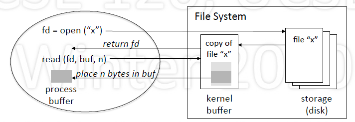
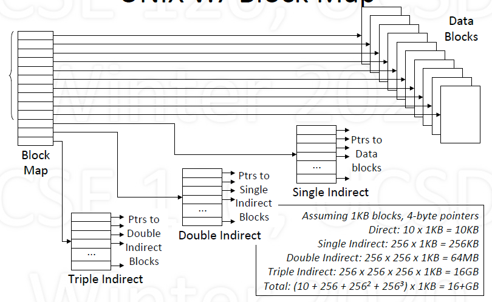
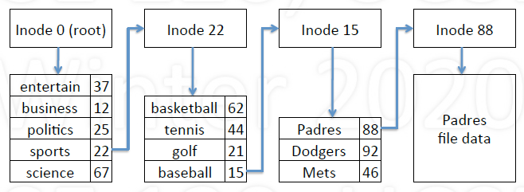
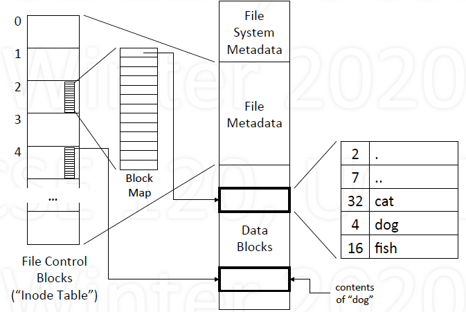
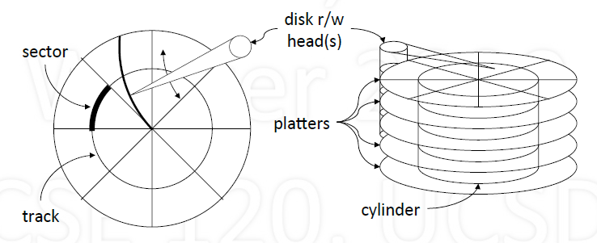

# File System

## Basic

1. Preview

    - File: logical unit of storage, container of data

        - Accessed by (name, region within file)

    - File System: a structured collection of files

        - Access control, name space, persistent storage

2. File System Abstraction

    - Repository of objects

        - Objects are data, programs for system and users
        - Objects referenced by name, to be read/written

    - More than a repository

        - Objects can be r/w, protected, shared, locked
        - Contains I/O devices: disk, keyboard, display
        - Processes: memory

    - Pesistent: remains "forever"
    - Large: "unlimited" size
    - Sharing: controlled access
    - Security: protecting information

3. Hierarchical File Name Space

    - Name space is organized as a tree

        - Name has components, branches start from root
        - No size restrictions
        - Intuitive for users

    - Example: UNIX "Pathnames"

        - Absolute: /a/b/c
        - Relative: b/c relative to /a
        - Not strictly a tree: links

## File

1. Attributes

   - Type (recognized by system or users)
   - Times: creation, accessed, modified
   - Sizes: current size, (maximum size)
   - Access control (permissions)

2. Operations

   - Creation: create, delete
   - Prepare for access: open, close, mmap
   - Access: read, write
   - Search: move to location
   - Attributes: get, set(e.g., permissions)
   - Mutual exclusion: lock, unlock
   - Name management: rename

3. Read/Write model

   - (file descriptor)fd = open(fname, usage)
   - nr = read(fd, buf, size)
   - nw = write(fd, buf, size)
   - close

       

4. Memory-mapped model

   - Map file into address space

       - mmap(addr, n, ..., fd, ...)
       - addr = mmap(NULL, n, ..., fd, ...)

   - Use memory ops

       - x = addr[5]
       - strcpy(addr, "hello")

   - Issues

       - Efficient for multiple process sharing memory
       - If memory is written, how is file actually updated?

5. Access Control

   - Who can access file
   - What operations are allowed
   - User interface must be simple and intuitive
   - Example: Unix

       - r/w/x permissions for owner, group and everyone

## File System Implementation

1. Goals

    - Archival storage

        - Keep forever, including previous versions

    - Support various storage technologies

        - Disks (different types), remote disks, ...

    - How to best achieve and balance:

        - Performance
        - Reliability
        - Security

2. Storage Abstraction

    - Hide complexity of device

        - Model as array of blocks of data
        - Randomly addressable by block number
        - Typical block size: 1KB (also 4KB ~ 64KB)

            - Generally multiple of disk sector size: 512B

    - Simple interface

        - read(block_num, mem_addr)
        - write(block_num, mem_addr)

3. **Typical Implementation Structure**

    - Three major regions: Sequence of blocks for each one
    - Region 1: File System Metadata

        - Information about file system
        - Sizes

            - Files in use, free entries
            - Data blocks in use, free entries

        - Free lists (or bitmaps)

            - File control blocks
            - Data blocks

    - Region 2: File Metadata (File Control Blocks)

        - Information about a file
        - Referenced by number/index
        - Contains

            - Attributes: type, size, permissions,...
            - References to data blocks: disk block map

        - Note: many file control blocks may fit in single storage block
        - Example:

            - Number: 88 (index in file control block array)
            - Size: 4096 bytes
            - Permissions: rw-r--r--
            - Data blocks: set of indexes into storage array, may not be contiguous (such as 567, 7076, 9201)

    - Region 3: Data Blocks

        - File contents

### File control blocks

1. Keeping track of allocated blocks

    - Contiguous blocks

        - Single sequence of blocks

    - Extents

        - Groups of contiguous blocks

    - Non-contiguous blocks

        - Blocks individually named

2. Keeping track of free blocks

    - Free Block Map

        - Compact if lots of free regions of space

    - Doubly Linked List

        - Easy to keep ordered due to fast inserts and deletes

    - Bit Map

        - Fixed size regardless of fragmentation

3. File Name to File Control Block

    - Users access files using file names
    - Problem: how to translate

        - from file name: "/sports/baseball/Padres"
        - to file control block number: 88

    - Must parse file name
    - Each branch corresponds to a directory/folder
    - Each directory/folder may itself be a file

### Example: UNIX v.7 Block Map

1. Block Map UNIX v.7

    - Array of pointers to data blocks
    - 13 Pointers

        - 10 direct: references 10 data blocks
        - 1 singly-indirect: references $n$ data blocks
        - 1 doubly-indirect: reference $n^2$ data blocks
        - 1 triply-indirect: reference $n^3$ data blocks

    - $n$ depends on how many pointers fit in a block

        - Example: 256 4-byte pointers will fit in 1KB block

            

2. Implementing UNIX Directories

    - Table where each entry contains

        - name and attributes
        - name and pointer to file control structure

    - Unix (name and pointer) - pre-BSD

        - Each entry: branch name (14), i-node number (2)
        - Berkeley Unix uses a more complex scheme to support long names

3. Example of parsing names in UNIX

    - Given pathname: /sports/baseball/Padres

        - Inode 0 block map points to data block(s) of root directory
        - Look up "sports" in root directory to get inode 22
        - Inode 22 blocks map points to data block(s) of sports directory
        - Look up "baseball" in sports directory to get inode 15
        - ...

            

            

### Storage

1. File Systems use disks for storage

    

    - pros: persistent, random access, cheap
    - cons: slow (mechanical)
    - Performance

        - Accesses are time expensive: 5 ~ 20 msec

            - Rotational latency: 2 ~ 6 msec (5200 ~ 15000 RPM)
            - Seek time: 3 ~ 13 msec
            - Transfer rate: 100+ MB/sec

        - Reduced accesses by

            - reading multiple blocks in one access (read ahead)
            - maintaining a block cache

        - Cluster related blocks to reduce seek time

2. Solid State Drives (SSD)

- NAND-based flash memory, non-volatile
- Unaffected by shock, magnetic fields; no noise
- Limited number of writes, wears out with age

### Performance

1. Caching

    - Data blocks of files
    - File system metadata (keep in memory)
    - File metadata

        - Currently active file
        - Recently used

    - Block maps
    - File names

        - Name to file metadata translations

2. Clustering

    - Blocks that exhibit locality of reference

        - Directory, and files within that directory
        - The inodes of the directory and files

    - Strategy

        - Place related blocks close to each other: clustering
        - Reduces disk head movement and seek time

3. Block size

    - trade off
        - the larger the block, the better the throughput
        - The smaller the block, the less wasted space

    - technology trend
        - Disk density is increasing faster than disk speed
        - Make disk blocks larger: 1KB $\rightarrow$ 8KB, 64KB, 1MB

### Reliability

1. Consistency

    - Buffer cache reduces disk access
    - If system crashes, block modifications lost
    - To improve file system consistency

        - write out modified blocks periodically
        - write out critical blocks

    - Critical blocks: file system meta-data

        - Directories, i-nodes, free block lists

2. Journaling

    - Journal: log of file (or file system) updates
    - For every update, create log entry
    - Write log entry out to disk (part of journal)
    - If crash occurs:

        - Look at journal entries
        - Check if mods properly reflected in file system
        - Update appropriately