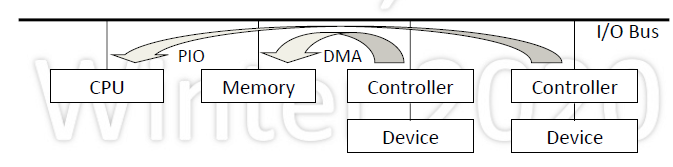
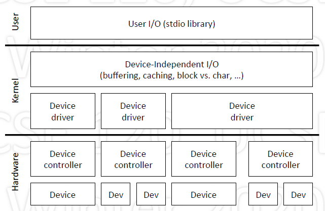
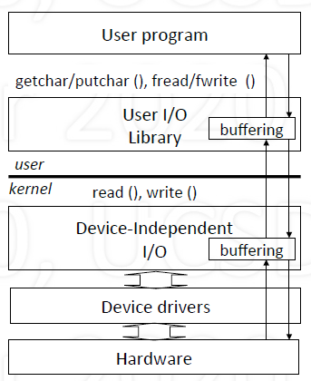
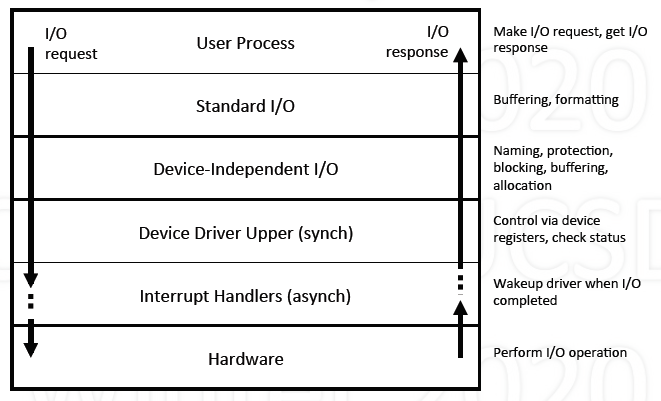
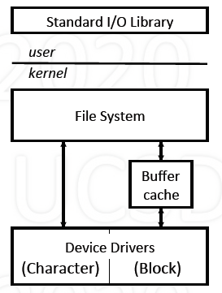

# Input/Output System

## I/O basic

1. Intro

    - I/O = Input/Output

        - Input from attached device to CPU/memory
        - Output from CPU/memory to device

    - Synchronization and transferring data

2. Issues

    - Problems:

        - So many different types of I/O devices
        - Wide range: speed, operation, data transfer units

    - Questions:

        - How does a process initiate I/O?
        - How is synchronization achieved?
        - How is data transferred?

3. Background: I/O Hardware

    - CPU and device (controller) communicate via

        - I/O instructions
        - Memory instructuions (memory-mapped)

    - Data transfer: progammed I/O vs. DMA (direct memory access)
    - Synchronization: polling vs. interrupts

        

4. Buffered/Unbuffered I/O

    - Pros:

        - What if pages containing buffer are paged out?
        - What if entire process is swapped out?
        - Can pin pages, but if too many processes do this?

    - Cons:

        - Memory copying is expensive
        - Consider effect on caches

5. Dealing with Complexity of Devices

    - Many different types of devices

        - Classify by shared characteristics
        - Imposes structure: shared code, lower complexity

    - Dimensions

        - Varaible vs. fixed size units
        - Sequential vs. random-access
        - Synchronous vs. asynchronous
        - Speed of operation

## I/O system

1. I/O system Intro

    - Software that deals with I/O

        - Mostly in the kernel
        - Also in processes (in form of library, e.g., stdio)

    - Separated into two portions

        - Device-dependent
        - Device- independent

    - Structure: Layered

        

2. Device Dependent: Device Drivers

    - Encapsulates device-dependent code

        - Contains device-specific register reads/write

    - Implements a standard interface

        - open(), close(), read(), write()

    - Interrupt handlers

        - Executes when I/O completes
        - Updates data structure
        - Wakes up waiting process

3. Device-Independent I/O

    - Uniform interfacing for device drivers
    - Naming, protection
    - Uniform block size
    - Buffering, caching
    - Storage allocation
    - Locking
    - Error handling

4. User-space I/O 

    - Convenient interface

        - printf() vs. write()

    - User-level buffering

        - Unix: stdio library

    - Spooling daemons

        - Printer

5. Overall Operation

    

### Example: UNIX

1. I/O Model 

    - Uses file system interface
    - stdio.h: C standard I/O library
    - Block devices (disks, USB cameras, ...)

        - Fixed-size blocks
        - Randomly addressable
        - Uses buffer cache

    - Character devices (serial ports, parallel ports, sound cards,...)

        - Variable sequence of bytes
        - For non-block devices

2. I/O System Call Interface

    - fd = open("/dev/devname", ...)
    - close(fd)
    - nr = read(fd, buf, n)
    - nw = write(fd, buf, n)
    - ioctl(fd, cmd, buf) //(input/output control)

3. Standard I/O Library

    - fopen, fread, fwrite, fprintf, fscanf, fclose, ...
    - Private buffer kept in user space
    - Minimizes the number of I/O system calls

4. Software Block Cache Design

    - Has copies of blocks that are also on disk
    - Upon read or write

        - Check if a buffer contains the block
        - If not, get from disk
        - To make room, remove LRU block
