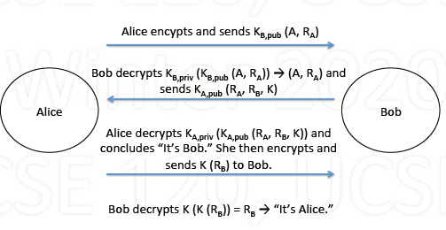

# Security

## Basic

1. What is Computer Security?

    - How to protect computer systems

        - System contents: data, software, hardware
        - System operation: performance, reliability
        - System service: what the user sees and expects

    - From various threats

        - Theft
        - Damage
        - Disruption

2. Aspects of Security

    - Confidentiality

        - keeping a secret secret; for authorized eyes only

    - Integrity

        - maintaining accuracy; only authorized changes

    - Authenticity

        - Is it really who/what it claims to be?

    - Availablity

        - access to info/resources you need, when needed

3. Security Threats

    - Interception

        - eavesdropping

    - Interruption

        - destroying, denial of service

    - Modification

        - tampering with data or programs

    - Fabrication

        - new data/programs, replaying message

## User Authentication

1. Password

    - Passwords are most common method

        - User and computer know secret
        - User proves knowledge of secret
        - Computer checks

    - Encrypted passwords

        - Computer stores only encrypted passwords
        - User provides password
        - Computer encrypts, checks

    - Problem with passwords

        - Assume 100 possible characters for passwords

            | # chars| # passwords | 100G/s machine | 100T/s machine |
            | :---: | :---: | :---: | :---: |
            | 6 | $100^6$ | 10 sec | 10 msec |
            | 7 | $100^7$ | 17 min | 10 msec |
            | 8 | $100^8$ | 1.2 days | 1.7min |
            | 9 | $100^9$ | 116 days | 2.8 hr|

        - But most characters are uncommon, hard to remember
        - Using dictionary words (~250,000): only 2.5 usec!

2. Challenge/Response Protocol

    - Challenge/response, algorithm passwords

        - User and system know secret algorithm
        - System challenge user's knowledge, user responds

    - Example: say secret algorithm is $f(x) = x^2$

        - System challenges user: sends system 9
        - User computes $f(x) = 9$, sends system 9
        - System concludes user must know secret algorithm
        - Next time, system can provide different challenge

    - Secret is never sent, only challenge/response

## Threats

1. Trojan Horse

    - Greeks invaded Troy in hollow wooden horse
    - Program that contains hidden malicious code

        - User thinks program does something useful
        - In actuality, it (also) does something harmful

    - Program runs as process in user's domain

        - Can do harm to user's environment
        - Can do harm under that user's name

2. Trap Door

    - Secret access point in program
    - Designer develops program for someone else
    - Once loaded in system, designer can access
    - Consider if trap door is added by compiler

        - Compiler adds trap doors to programs
        - Designer of compiler can then access
        - Can't tell from program source code
        - Even if new compiler written, must be compiled!

3. Virus

    - Code attached to legitimate program
    - When program runs, the virus runs

        - causes damage
        - spreads, attaching itself to other programs

    - Disinfectants

        - Check that programs look normal (modified)
        - Check for known virus patterns in programs

4. Internet Worm

    - Worm: program that copies itself over network by email, finger, rsh attack

5. Denial of Service

    - Preventing others from using system

        - by using lots of resources
        - by bombarding with network requests or traffic

    - Example

        - Repeatly request TCP connection
        - Don't answer responses; system times them out
        - Eventually, no TCP ports left available

## Approach to clear (prevent) threats

### Intrusion Detection

1. Intrusion Detection

    - Detecting if there is an intruder, or an attack
    - Signature-based

        - Look for specific patterns of attack behavior
        - Example: repeated login attempts

    - Anomaly-based

        - Look for unusual behavior
        - Example: unusual command/system call patterns

    - Solution: create audit trail (log), then analyze it

### Crytography

1. Basics

    - Encoding messages to

        - limit who can view the original message
        - determine who sent a message

            

2. Secret Key Encryption

    - Secret key (symmetric)

        - Same key K is used to encrypt and decrypt
        - Sender encrypts $E_k(P)$, Receiver decrypts $D_k(E_k(P))$

    - DES: Data Encryption Standard (1997)

        - Weak due to 56-bit keys

    - AES: Advanced Encryption Standard (2001)

        - 128, 192, 256-bit keys

3. Public Key Encryption

    - Public key (asymetric)

        - Different keys to encrpyt and decrypt
        - Each user has two keys: one public, one private

    - If A wants to send to B

        - A encrypts using B's public key
        - B decrypts using its private key

    - RSA (Rivest, Shamir and Adelman)

4. Public key vs. Secret key

    - Secret key

        - Operates fast
        - Difficult to distribute keys

    - Public key

        - Time-consuming operation (generating random/prime number, see example below)
        - Conveninet for key distribution

    - Example: Alice chats with Bob
    - Bob authenticates Alice

        

    - Alice authenticates Bob

        

    - Authentication using public key

        - Alice: sends $K_{B,pub}(A, R_A)$ to Bob (uses Bob's public key)
        - Bob:

            - Decrypts: $K_{B,priv}(K_{B,pub}(A, R_A))\rightarrow (A, R_A)$
            - Encrypts and sends $K_{A,pub}(R_A, R_B, K)$ to Alice

        - Alice:

            - Decrypts: $K_{A,priv}(K_{A,pub}(R_A, R_B, K))\rightarrow$ "It's Bob"
            - Encrypts and sends $K(R_B)$ to Bob

        - Bob: Decrypts $K(K(R_B)) = R_B \rightarrow$ "it's Alice"

        - whole process:

            

5. Digitial Signatures

    - If Alice wants to digitially sign message to Bob

        - Encrypt M using $K_{A,priv}$ and send $K_{A,priv}(M)$ to Bob

            

    - When Bob receives, decrypts using $K_{A, pub}$

        - can decrypt only if from Alice

    - To sign and keep private

        - Alice sends $K_{B,pub}(M, K_{A, pirv}(M))$ to Bob
        - Only Bob can decryptL $K_{B,priv}(K_{B,pub}(M, K_{A,priv}(M))$
        - Decrypts using $K_{A,pub}$ proving Alice signed it

            
