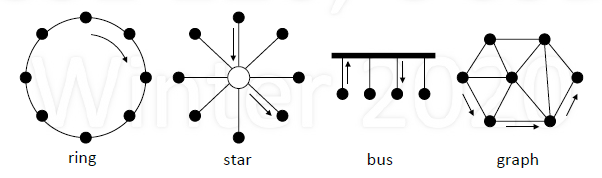

# Network

## Basics

1. What is a Network?

    - Network

        - Set of computing nodes
        - Connected by communication links
        - Allow data transfer by a sender to a receiver

    - Internetwork: a network of networks

        - The "Internet" is a global internetwork
        - Nodes communicate using IP (Internet Protocol)

2. Types of Networks

    - By topology: ring, star, bus, graph

        

    - By geographic coverage

        - LAN: local area network (spanning floor, building)
        - WAN: wide area network (spanning state, country)

3. Circuit-switch vs. Packet switching

    - Circuit switching: establish path, send data

        - Reserve resources provide performance control
        - Example: telephone system

            

    - Packet switching: forward packets hop to hop

        - Fair sharing despite burst, statistical multiplexing
        - Example: postal system

            

## Protocol

1. What is protocol?

    - Goal: get message from sender to receiver
    - Protocol

        - agreed message format and transfer procedure

    - Multiparty, so no central thread of control

        - Sender and reciver are separate processes

    - Expectations of operation

        - first you do x, then I do y, then you do z,...
        - If you do q, I'll do p

2. Message

    - Message: contains header and data

        - Similar terms: packet, datagram, frame

    - Data: what sender wants to receiver to know
    - Header: information to support protocol

        - Source and destination addresses
        - State of protocol operation
        - Error control (to check intergity of received data)

    - Example:

        - Assume: Ann sends message to Bob locally (same city)

            - Message format: (from, to), message contents
            - Transfer procedure: post on refrigerator

                

        - What if Ann sends message to Bob in different cities

            - Message format: address(es) on envelope, letter
            - Transfer procedure: postal system

                

    - Summary (*Layering: Separation of Functions*)

        - Ann and Bob

            - Don't have to know about delivery
            - However, aid postal system by providing addresses

        - Postal System

            - Only has to know addresses and how to deliver
            - Doesn't care about "data": Ann, Bob, letter

3. 7 Layers of OSI (Open Systems Interconnection) Refernce Model

    - Overview

        | layer | name | function |
        | :---: | :--- | :--- |
        | 7 | Application | application protocol, e.g., HTTP |
        | 6 | Presentation| syntax, network format |
        | 5 | Session | start/stop/manage connections |
        | 4 | Transport | segment, reliability, flow control|
        | 3 | Network | logical addressing, routing |
        | 2 | Link | physical addressing, framing |
        | 1 | Physical | 0's and 1's over a wire|

    - Internet Protocol Stack 

        - "Hourglass" design
        - Application: Email, Web
        - Session: sockets
        - Transport: TCP, UDP, ...
        - Network: IP (Only one kind of protocol in this layer, which makes Internet Internet!)
        - Link: Ethernet, ATM, ...
        - Physical

    - Encapsulation

        - Higher level n with lower level n - 1
        - Can also have level within a level: tunneling
        - Multiplexing and de-multiplexing

4. Addresses

    - Generally, three levels of addresses

        - Domain names: cs.ucsd.edu
        - Logical addresses (IP): 128.53.27.92
        - Physical addresses (Ethernet): 0x27A5BB17019D

    - Address resolution

        - Mapping higher level name to lower level name
        - Techniques: table lookup, formula, protocol

    - Sizes of address spaces

        - IPv4 (version 4, current/past)

            - 32 bit addresses
            - $2^32$ = 4 billion addresses

        - IPv6 (version 6, future/current)

            - 128 bit addresses
            - $2^{128} = 2^8\times (2^{10})^{12} = 256 \times (10^3)^{12} = 2.56 \times 10^{38}$

5. Routing

    - Routing: how to get packet from A to B

        - A forwards to X; X to Y; Y to Z; Z to B

            

    - Each intermediate node can be a decision point

        - Static: always make the same decision
        - Dynamic: decision can change (e.g., based on state)

6. Scalability

    - How well does system grow

        - in terms of performance, reliability, etc

    - Ramifications of adding node or link

        - Local effects vs. global effects

    - Information growth: import to reduce

        - Amount stored at nodes
        - Amount exchanged between nodes

7. Error Control

    - Parity: even, odd, two-dimesional
    - CRC (cyclic redundance code)
    - Checksum
    - Automatic repeat request (ARQ)

8. The two general's problem