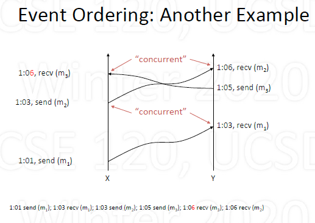

# Distributed System

## Basic

1. What is a distributed system?

    

    - Cooperating processes in a computer network
    - Degree of integration

        - Loose: Internet applications, email, web browsing
        - Medium: remote execution, remote file systems
        - Tight: process migration, distributed file systems

    - Advantage

        - Speed: parallelism, less contention
        - Reliability: redundancy, fault tolerance, "NSPF"
        - Scalability: incremental growth, economy of scale
        - Geographic distribution: low latency, reliability

    - Disadvantages

        - *Fundamental problems* of decentralized control

            - State uncertainty: no shared memory or clock
            - Action uncertainty: matually conflicting decisions

        - Distributed algorithms are complex

2. Is distribution better? 

    - Single fast server with single queue
    - Multiple slower servers with separate queues

        - Typically better than the first one

    - Multiple slower servers, single queue

        - Better than the first two

    - Little's Law: $N = \lambda W$

        - Use to calculate processing time (assuming stable)

## Models used in cooperating system

1. The Client/Server Model

    - Client

        - Short-lived process that makes requests
        - "User-side" of application

    - Server

        - Exports well-defined requests/response interface
        - Long-lived process that waits for requests
        - Upon receiving request, carries it out (may spawn)

2. Peer-to-Peer

    - A peer talks directly with another peer

        - No intermediary (e.g., central servel) involved
        - Symmetric (unlike asymmetric client/server)

    - *In actuality, may be dynamic client/server*

        - A requests file from B; A acts as client, B as server
        - C can now request file from A; A acts as server

### Distributed Algorithms

1. Event ordering

    - Order events given no shared clock/memory
    - Happened-before relations: $\rightarrow$

        - A, B events in same process and A before B: $A\rightarrow B$
        - A is a send event, B is a receive event: $A\rightarrow B$
        - If $A\rightarrow B$ and $B\rightarrow C$, then $A\rightarrow C$

    - Implementation

        - Timestamp all events based on local clock
        - Upon receiving a message, advance local clock
        - Resolve ties by ordering machines

    - Example

        - Example 1 (When timing conflicting, follow rules above):

            

            

        - Example 2:

            

            

            

2. Leader election

    - Many distributed algorithms rely on leader
    - Need to determine if leader exists; if not elect
    - Bully algorithm (elect leader L)

        - Every process is numbered (priority): P1, P2, ...
        - $P_j$ sends request to L, no reply; tries to elect itself
        - $P_j$ sends "Can I be leader?" to all $P_{k>j}$
        - No replies, $P_j$ sends to all $P_{i<j}$, "I am leader", done
        - If some $P_{k>j}$ replies, $P_j$ let $P_k$ try to elect itself
        - If no message from $P_k$, $P_j$ tries to elect itself again

3. Mutual exclusion

    - Centralized approach

        - Single process acts as coordinator server
        - Request, reply (to allow entrance), release

    - Distributed approach

        - Process sends time-stamped request to all others
        - Waits until it receives replies from all (ok to other)
        - Enter critical section (may get requests, defers)
        - Upon exiting, responds (to release) to all deferred
        - Use timestamps to order "simultaneous" requests
