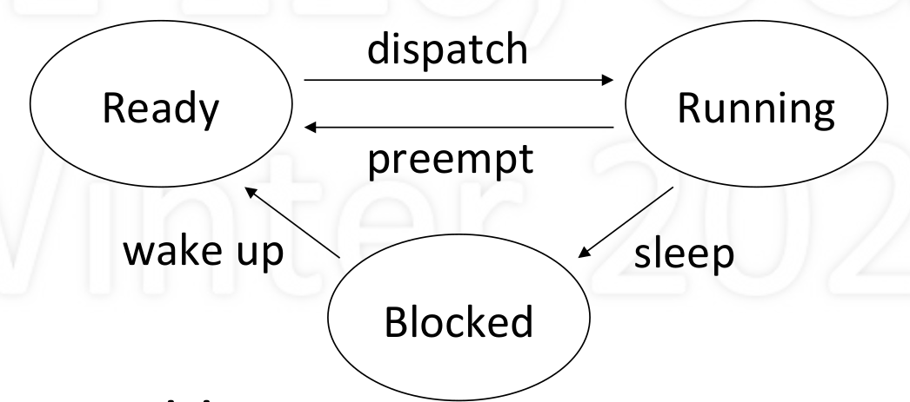
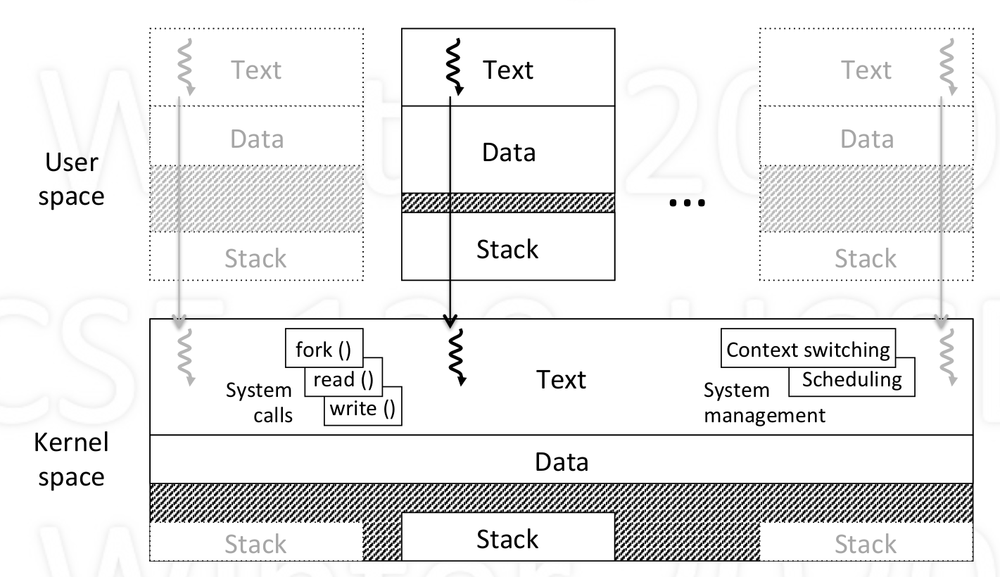
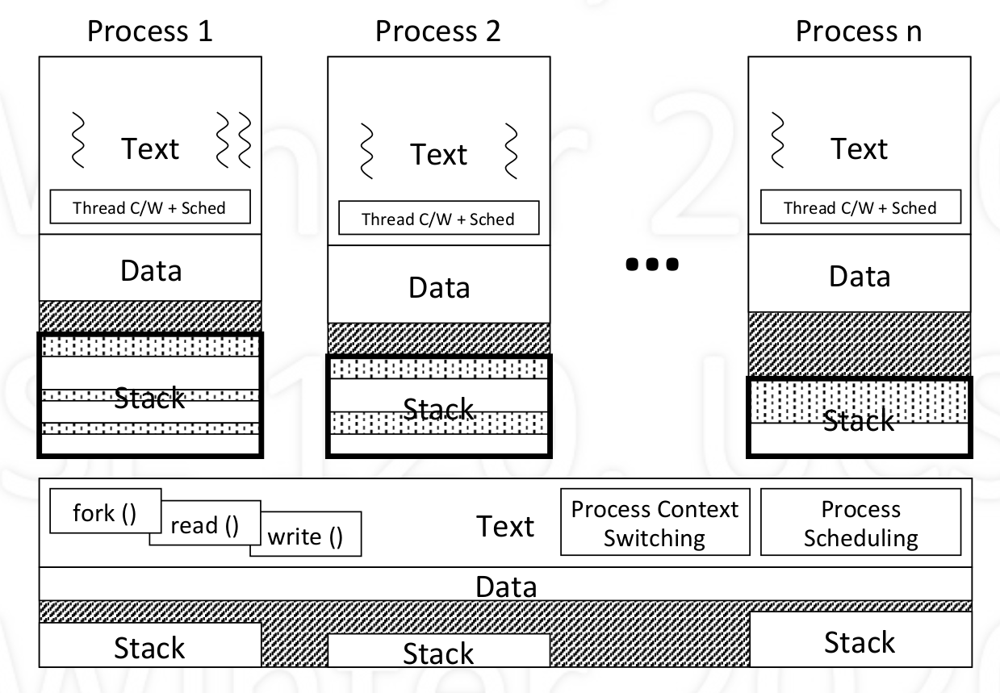
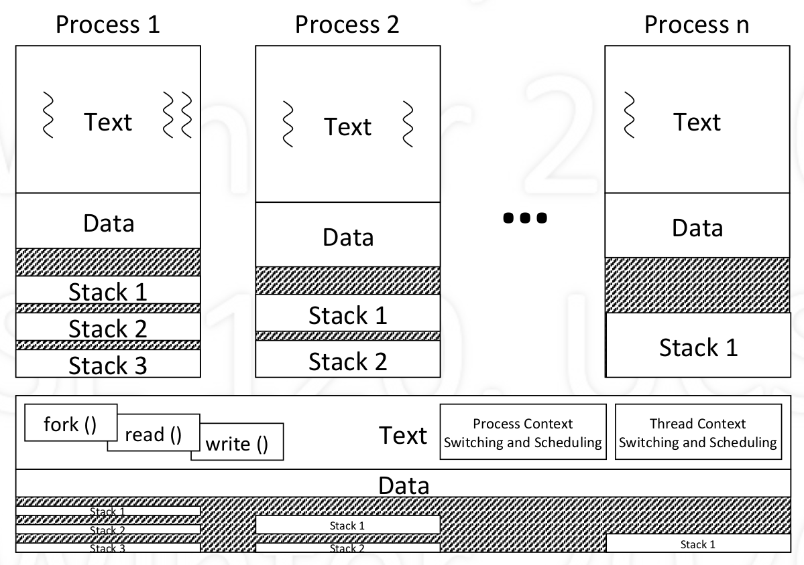

# Time sharing

1. Definition

   - Multiple processes share single CPU resources
   - Conceptually, each process makes progress over time
   - Practically, each perioadcally get quantum of CPU time
     - *quantum* : a basic time unit for CPU to allocate for a cycle
   - Illusion of parallel progress by rapidly switching CPU

2. Implementation

   - Kernel keeps track of progress of each process
   - Divided the states (progress) of each process:
     - Running: actually running (making progress), using CPU
     - Ready: able to make progress, but not using CPU
     - Blocked: unable to make progress (waiting other resources like memory, I/O etc), cannot use CPU
   - Kernel selects a ready process and let it use CPU

3. Process State Diagram

    - Dispatch: allocated the CPU to a process
    - Preempt: take away CPU from process
    - Sleep: process gives up CPU to wait for event
    - Wakeup: event occurred, make process ready

4. Kernel
    - A seperate memory space that store kernel code that support user processes to run
      - systems calls: fork(), exit(), read(), write(), yield(),...
      - management: context switching, scheduling,...
    - Keep track of state of each process
      - each process has a unique ID
    - Store other info needed
      - areas of memory being used
      - contents of CPU contexts
      - other...
    - runs as an extension of current process
      - when system call (process give up control to kernel voluntarily)
      - hardware interrupt (preemption)
        - timer
    - Has text, data and multiple stack (each for each process/thread)
      - even if two process share the same code, use seperate memory(text, data, stack) to store state of each process

        

5. Threads

    - It's a single sequential path of execution
    - Abstraction: independent of memory(may have different implementation like user-level and kernel-level)
    - A thread is a part of a process
      - Lives in the memory of a process (share global variable)
      - Multiple threads may exist in a process
    - To the user: unit of parallelism
    - To the kernel: unit of schedulability

6. User-level threads vs Kernel-level threads

    - user-level thread:
      - Implement stacks for different threads in user space (actually share the stack in kernel)
      - Pros:
        - Threads call and management in user level
        - Efficient: no need to trapped into kernel (which is heavy)
        - No need for kenerl support of threads
      - Cons:
        - no true parallelism (kernel see no threads but process)
        - mulitple CPU cannot let multiple threads in one process run at the same time

            

    - kernel-level thread:
      - Implement stacks for different threads in kernel space
      - Pros:
        - can achieve true prallelism
      - Cons:
        - overhead: thread switch requires kernel call

            

    - Distinguish:
      - Where is the thread abstraction supported: kernel code or user code
      - Where is the thread running: user space or kernel space
