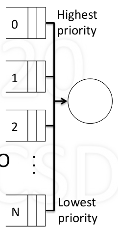
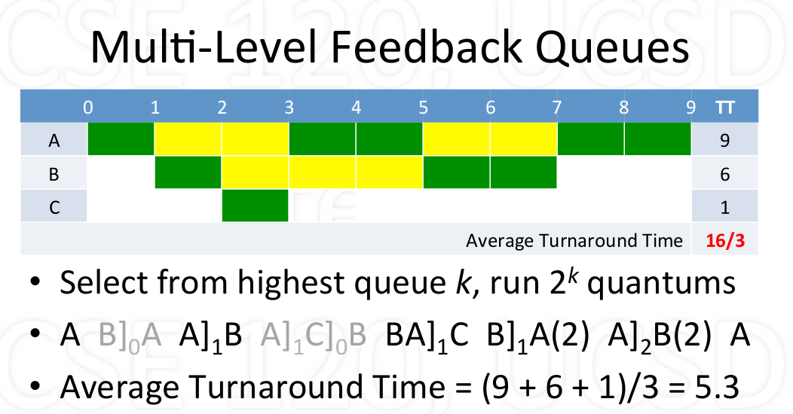
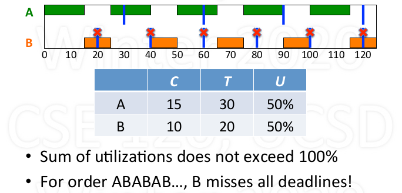
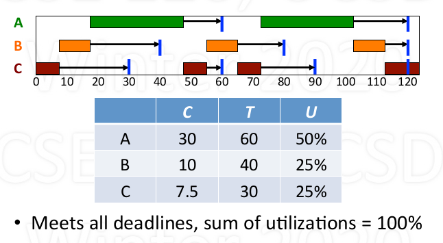
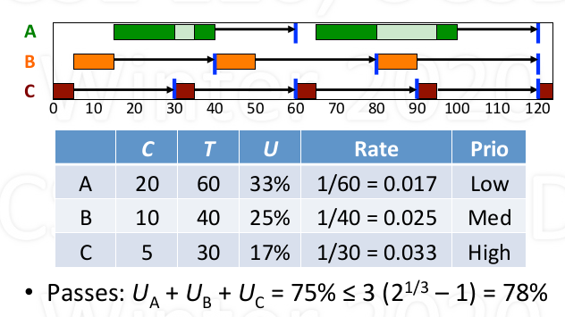

# Scheduling

## Basic problem and goal

1. Problem introduction
    - Given multiple processes and one CPU, which process gets CPU and when?
    - How much CPU time does each process get?
    - Possible approaches:
      - Let one process keep CPU till done then switch to another
      - Each process uses CPU a bit and passed it on
      - Ech process gets proportinal to what they pay (demand)
    - Which policy(ies) is the best?
      - Depends on the goals of the system
        - Personal computer
        - Large time-shared computer
        - computer controlling a nuclear power plant...
      - Even one system might have multiple(and somtimes conflicting) goals

2. Some parameters needed in scheduling
    - Arrival time: time that process is created
    - Service time: CPU time needed to complete (most time unknown to the kernel)
    - Turnaround time: from arrival to departure (actually time needed to finish the process, including running time and waiting time)
    - Try to minimizes average turnaround time

## Different scheduling policies

### Let one process run till done (non-preemptive)

1. Consider the service time for each process (suppose each process arrived at the same time)

    - *Longest first vs shortest first*: Let the longest/shortest processes among all the process created and not yet exit to run till done and then decide the next
    - **Proven: Shortest first is optimal**
    - However, the service time is unknown to the kernel in most of the time

2. Consider the arrival time

    - *First come first serve(FCFS) vs Last come first serve(LCFS)*: Allocate the CPU to process arrived earliest or latest.
    - First come first serve(FCFS)
      - non-preemptive, simple, no stavation
      - poor for short process arrived late
    - Last come first serve(LCFS)
      - simple
      - starvation, poor for short process arrived early

3. Shortest process next (SPN)

    - when one process finish, select the process with shortest service time
    - **Proven: optimal for non-preemptive policies**
    - may cause starvation (when short process keep arriving, long process get no chance to run)
    - However, the service time is unknown to the kernel in most of the time

### Select process when each quantum end (preemptive)

1. Round Robin (RR)

    - Time-slice: each process gets quantum in turn
    - Preemptive, simple, no starvation
    - Each process waits at most (n - 1) x quantum (supposed n is fixed)

2. Shortest remaing time (SRT)

    - At the end of each quantum, select process with shortest remaining time
    - **Proven: optimal for preemptive policies**
    - may cause starvation (same case as SPN)
    - Assumes service times are known (which is difficult)

3. Multi-level feedback queues 

    - Priority queues 0 to N (from high to low)
    - new processes enter queue 0 (highest priority)
    - Each quantum select from highest priority queue (FIFO within the queue)
    - For each process selected, run it for $T = 2^k$ quantums
      - if the process used T quantums, move it next loewer queue
      - if the process used less than T quantums, back to same queue
        - due to yield or higher priority arrival
    - Periodically boost (all to the queue 0)
    - Features:
      - Complex, adaptive, highly responsive
      - Favors shorter over longer, possible starvation (higher priority queue run shorter time)
    - Example

        

4. Priority scheduling

    - Select process with highest priority
    - Calculate priority based some external criteria
      - E.g., priority = $\frac{1}{CPU_{time used}}$

5. Fair share (Proportional share)

    - Assumed ach process requests ome CPU utilization
    - Goal: utilization over long run, actual $\approx$ request
    - Select process with minimum actual/request ratio, when some processes have same minumum ratio, randomly choose one.
    - involving float number calculation in each quantum, maybe over head.

6. Stride shceduling (practical implementation for Fair share)

    - For each process x with certain CPU utilization requested, calculate strides: $S_x = \frac{1}{R_x}$
    - For each process x maintain pass value $P_x$ (initialized 0)
    - In each quantum:
      - Select process x with minimum pass value P to run
      - Increment pass value with selected process by its stride value: $P_x = P_x + S_x$
    - Optimization: use only intergers for $R_x, S_x, P_x$
      - Calucalte $S_x = \frac{L}{R_x}$, where L is very large like 1000000.

### Real Time Scheduling

#### Basics

- Reason (correctness) for real-time scheduling

  - depends on logical result of computations
  - timeing for these result

- Type of real-time systems
  - hard vs. soft real-time
  - Periodic vs. aperiodic

#### Type of processes

- Periodic Process (Tasks)
  - A periodic process has a fixed frequency at which it needs to run.
  - Before each deadline it must run for a certain CPU time
  - For each process with a period, we have C (CPU burst needed), T (period), U (C/T, utilization)
  - Example

    

- Aperiodic Process
  - Aperiodic processes have no fixed, cyclical, frequency between events.
  - For this type of process, real-time scheduling is not necessary

#### Different real-time Scheduling

1. Earliest Deadline First (EDF)

    - schedule process with earliest deadline
    - *if a earlier deadline process appears, preempt*
    - Pros:
      - works for periodic and aperiodic processes
      - Achieve 100% utilization (igoniring overhead)
    - Cons:
      - Expensive: requires ordering by deadline frequently
    - Example:

        

2. Rate Monotonoic Scheduling (RMS)

    - If periodic processes exist, priorityize based on rates
    - At start of period, select highest priority
    - Preempty if necessary
    - When burst done, wait till next period
    - Deadline met require:  **$U_1 + ... + U_n \leq n (2 ^ {1/n} - 1)$**
    - Example:

        

3. More on RMS

    - RMS is simple and efficient (static priority)
    - RMS is **optimal for static priority algorithms**
      - if RMS can't schedule, no other static priority can
    - RMS is limited in what it guarantees
      - **Utilization bounded by $n(2^{1/n}-1) > \ln{2}$ ~ 69%**
      - if bounded exceeded, no guarantess (but may not fail)
    - RMS is limited to periodic processes

### Summary

| scheduling policy | feature                        |
|:----              |:----                           |
| FCFS              | very simple, non-preemptive    |
| RR                | simple, preemptive             |
| SPN               | threoretical, non-preemptive   |
| SRT               | threoretical, preemptive       |
| MLFQ              | adaptive, reponsive, complex   |
| Priority          | external criteria              |
| FS                | proportional allocation        |
| EDF               | 100% utilization, high overhead|
| RMS               | < 100%, low overhead           |
