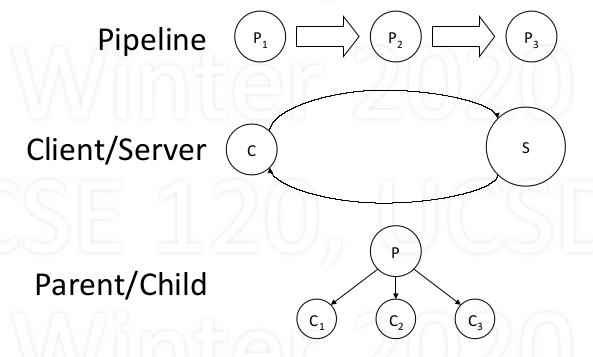
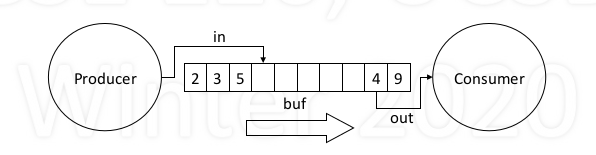
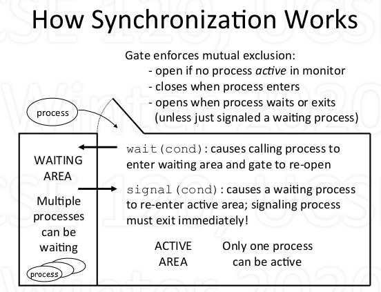
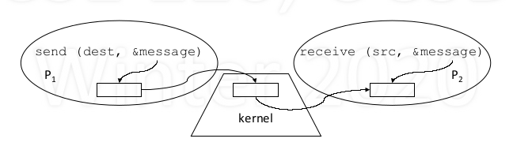

# Inter-process communication (IPC)

1. Cooperating Processes and IPC

   - Advantage of Cooperating Processes
     - performance: speed
       - Exploit inherent parallelism of computation
       - Allow some parts to proceed why other do I/O
     - Modularity: resuable self-contained programs
       - Each may do a useful task on its own
       - May also be useful as a sub-task for others
     - Examples:

        

   - IPC: communication between processes
   - **IPC requires**:
     - data transfer
     - synchronization
   - **Three abstraction for IPC**
     - shared memory + semaphores
     - monitors
     - message passing

2. The producer/consumer problem

   - Producer produces data, inserts in shared buffer
   - Consumer removes data from buffer, consumes it
   - Cooperation: Producer feeds Consumer
     - How does data get from producer to consumer?
     - How does consumer wait for producer?
   - Example:

     

3. Shared memory + semaphore

   - implementation:

    ```C
      shared int buf[N], in = 0, out = 0;
      sem filledslots = 0, emptyslots = N, mutex = 1;

      // Producer1, 2, ...
      while (true) {
        wait (emptyslots); // wait for available empty slots
        wait (mutex); // avoid racondition
        buf[in] = Produce();
        in = (in + 1) % N;
        signal(mutex);
        signal(filledslots); // increment the number of filled slots
      }

      // Consumer1, 2, ...
      while (true) {
        wait(filledslot);
        wait(mutex);
        Consume(buf[out]);
        out = (out + 1) % N;
        signal(mutex);
        signal(emptyslots);
      }
    ```

   - work for multiple producers and consumer
   - Not easy to understand(many wait/signal statements), easily leads to bugs

4. monitors

   - Programming language contruct for IPC
     - monitors are variables requiring controlled access
     - accessd via procedures
     - condition variables
       - wait(cond)
       - signal(cond)

   - Only one process can be active inside monitor

   - Usage

    ```C
    // a possible monitor implementation (provided by programming language)
    monitor ProducerConsumer {
      int buf[N], in = 0, out = 0, count = 0;
      cond slotavail, itemavail;

      void PutItem (int item) {
        if (count == N) wait(slotavail);
        buf[in] = item;
        in = (in + 1) % N;
        count++;
        signal(itemavail);
      }

      int GetItem() {
        int item;
        if (count == 0) wait(itemavail);
        item = buf[out];
        out = (out + 1) % N;
        count--;
        signal(slotavail);
        return (item);
      }
    }

    // Producer
    while (true) {
      PutItem(Produce());
    }

    // Consumer
    while (true) {
      Consume(GetItem());
    }
    ```

   - mechanism

      

   - more on Monitors
     - If one process A siganl condition c while another process B is waiting on c, at that time two process are able to run at the same time, which breaks mutual exclusion. **So each process only signal condition just before returning.**
     - *Contition variable have no memory*
       - It has no value and only indicate whether an event occurs or not
       - Signal without someone waiting does nothing
       - Signal is "lost"
     - Monitors bring structure to IPC
       - localizes critical sections and synchronization

5. Message Passing

    - Model:

        

    - methods:
      - send(destination, &message)
      - receive(source, &message)

    - Data transfer: in to and out of kernel message buffer
    - Synchronization: receive blocks to wait for message

    - Usage

        - basic

            ```C
            /* NO SHARED MEMORY */
            // Producer
            int item;

            while (true) {
            item = Produce();
            send(Consumer, &item);
            }

            // Consumer
            int item;

            while (true) {
            receive(Producer, &item);
            Consume(item);
            }
            ```

        - with Flow Control

            ```C
            // Producer
            int item, empty;

            while (true) {
                item = Produce();
                receive (Consumer,&empty);
                send(Consumer, &item);
            }

            // Consumer
            int item, empty;

            do N times {
                send(Producer, &empty);
            }

            while (true) {
                receive(Producer, &item);
                send(Producer, &empty);
                Consume(item);
            }
            ```

    - more on Message Passing
        - who should message be addressed to?
            - ports("mailbox") rather than specific process

        - how to make process recieve from anyone?
            - pid = receive(*, &message)?
        - kernel buffering: outstanding message
            - message sent that haven't been received yet
        - Good praradigm for IPC over networks
        - Safer than shard memory paradigms
