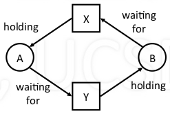
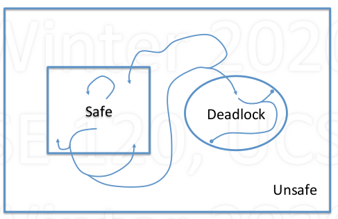

# Deadlock

## Basic

1. Definition

    - Set of processes are permanently blocked
      - Unblocking of one relies on progress of another, but none can make progress
    - Example
        - Process A holding resource X, waiting for resource Y
        - Process B holding Y, waiting for X
        - these two process will not be able to make any progress

            

    - Another example: memory
      - Total memory = 200MB
      - P1 holds 80MB, requests 60MB
      - P2 holds 70MB, requests 80MB

2. __**Four conditions for Deadlock**__

      - Mutual Exclusion
        - Only one process may use a resouce at a time
      - Hold-and-Wait
        - Process holds resouce while waiting for another
      - No Preemption
        - Can't take a resource away from a process
      - Circular Wait
        - The waiting process form a cycle

3. Attack the Deadlock Problem

    - Deadlock prevention
      - Make deadlock impossible by removing one (or more)condition
    - Deadlock Avoidance
      - Avoid getting into situations that lead to deadlock
    - Deadlock Detection
      - Don't try to stop deadlocks
      - If they happen, detect and resolve

## Attck the deadlock

1. Deadlock prevention

    - Mutual exclusion -> relax where sharing is possible
    - Hold-and-Wait -> Get all resources simultaneously (wait until all free)
    - No preemption -> allow resources to be taken away
    - Circular wait -> order all the resources, force ordered acquisition

2. Deadlock Avoidance

    - Avoid getting into situations that lead to deadlock
      - Selective prevention
      - Remove condition only when deadlock is possible
    - Works with incremental resource requests
      - Resources are asked for in increments
      - Do not grant request than can lead to a deadlock
    - Need maximum resource requirements
    - **Banker's Algorithm**
      - Fixed number of processes and resources
      - System state: either safe or unsafe
        - Depends on allocation of resources to processes
      - Safe: deadlock is absolutely avoidable
        - Can avoid deadlock by certain order of execution
      - Unsafe: deadlock is possible(but not certain)
        - May not be able to avoid deadlock
      - Diagram

          

3. Deadlock Detection (*mostly used!*)

    - Method
       - Periodically try to detect if a deadlock occurred
       - Do something (or nothing) about it

    - Resoning
       - Deadlocks rarely happen
       - Cost of prevention or avoidance not worth it
       - Deal with them in special way (may costly)

    - Recovery from deadlock
      - Terminate all deadlocked process (reboot)
    - Terminate deadlocked processed one at a time
      - need to detect
