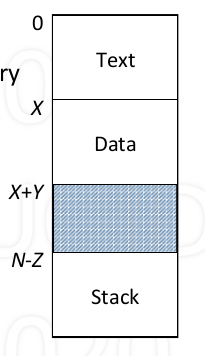
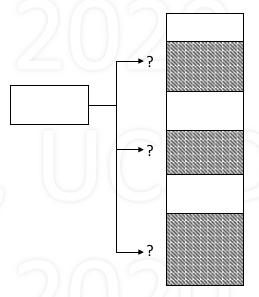

# Memory Management

## Basic

1. Allocation of memory occurs when

    - new process is created
    - process requests more memory

2. Freeing of memory occurs when

    - process exits
    - process no longer needs memory it requested

3. Memory overview

    - Porcess memory store:

        - Text: code of program
        - Data: static varibales, heap
        - Stack: automatic variables, activation records
        - Other: shared memory regions

    - Process memory address space 

        - Address space

            - set of addresses to access memory
            - Typically, linear and sequential
            - 0 to N-1

        - Example (right):

            - Text of size X at 0 ~ X-1
            - Data of size Y at X ~ X+Y-1
            - Stack of size Z at N-Z ~ N-1(grow reversely)

    - Compiler's model of memory

        - Compiler generates memory address

            - Address ranges of text, data, stack
            - allow data and stack to grow

        - What is not known in compiler

            - Physical memory size
            - Allocated region of physical memory

    - Memory characteristics

        - Size, fixed or variable (max size)
        - Permission: r, w, x

4. Goal: support multiple processes

    - Support programs running "simultaneously"

        - implement process abstraction
        - Multiplex CPU time over all runnable processes
        - Disk r/w speed is low: must keep multiple processes in memory

    - Process requires more than CPU time: memory

5. Memory issues and topics

    - Where should process memories be placed? -> Memory Management
    - How does the compiler model memory? -> Logical memory model, segmentation
    - How to deal with limited physical memory? -> Virtual memory, paging
    - Machanism and Policies

## Memory Managemeng Implementation

1. example process 

    - Phsical memory starts as one empty "hole"
    - When processes are created, areas get allocated
    - To allocate memory

        - find large enough hole
        - allocate region within hole
        - mostly leaves smaller hole (when the hole size does not exactly match the size of process memory)
        - when process exit (or memeory no longer needed), release that area, which create a new hole, coaleasce with adjacent

    - problem: if there are multiple holes, which to select?

        - *First fit: simple, fast*

            - consider tradeoff: fit vs. search time
            - memory is cheap, time is expensive

        - Best fit: optimal, must check every hole, leaves very small fragments
        - Worst fit: leaves large fragments, must check every hole

    - complication: is region fixed or variable size?

2. Fragmentation

    - Over time, memory becomes fragmented, there may be signficant unused space (fragmented)
    - Internal fragmentation

        - Unused space within (allocated) block
        - Cannot be allocated to others
        - Can come in handy for growth (for stack or heap)

    - External fragmentation

        - Unused space outside any blocks (holes)
        - Can be allocated (too small/not useful)

    - Approaches

        - Compaction

            - Simple idea
            - Very time consuming

        - Break block (to be allocated) into sub-blocks

            - Easier to fit
            - But complex

        - Use pre-sized holes

            - Same-sized holes:

                - all holes same, easy allocation
                - may be too small which is inflexible

            - Varaiety of sizes (small, medium, large)

                - more flexible
                - complex
                - what should sizes be? how to determine

            - Not adaptable, cause internel fragmentation

3. Some rules

    - 50% Rule: m = n / 2

        - Block: an allocated block
        - Hole: free space between blocks
        - m = number of holes
        - n = number of blocks

    - **Unused Memory Rule: f = k / (k + 2)**

        - Given average size of blocks and holes are known
        - b = average size of blocks
        - h = average size of holes
        - k = h / b, ratio of average hole-to-block size
        - f = k / (k + 2) is fraction space lost to holes

    - Usage:

        - k = 1, f = 1/3 -> avg hole size = avg block size, 33% waste
        - k = 2, f = 1/2 -> avg hole size = 2 * avg block size, 50% waste
        - k = 8, f = 4/5 -> avg hole size = 8 * avg block size, 80% waste

    - Limits

        - In general, f increases with increasing k

            - as $k \rightarrow \infty, f \rightarrow 1$
        - Alternatively, f decreases with decreasing k

            - as $k \rightarrow 0, f \rightarrow 0$

4. __The Buddy System__

    - Partition into power-of-2 size chunks
    - Allocation: given request for size r

        ```C--
        find chunk larger than r (else return failure)
        while (r < sizeof(chunk) / 2)
            divide chunk into buddies (each 1/2 size)
        allocate the chunk
        ```

    - Free: free the chunk and coalesce with buddy

        ```C--
        free the chunk
        while (buddy is also free)
            coalesce
        ```

    - [visualization](https://opendsa-server.cs.vt.edu/ODSA/Books/Everything/html/Buddy.html)

    - Data structure for buddy-system -> binary tree
