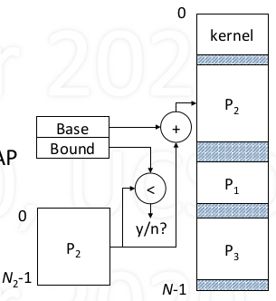
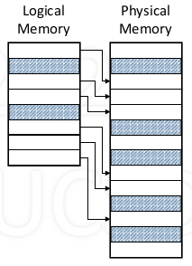

# Logical Memory

## Introduction

1. Definition

    - Logical memory = a process's memory
    - As viewed (referenced) by a process
    - Allocated without regard to physical memory

2. Problems with sharing memory

    - The addressing problem

        - Compiler generates memory reference
        - Unknown where process will be located

    - The protection problem

        - Modifying another process's memory

    - The space problem

        - The more processes there are, the less memory each individually can have

3. Logical vs. Physical Addressing 

    - Logical addresses

        - Assumes seperate memory starting at 0
        - Compiler generated
        - Independent of location in physical memory

    - Convert logical to physical

        - Via software: at load time
        - Via hardware: at access time

    - Hardware for Logical addressing 

        - Base register filled with start address
        - To translate logical address, add base
        - Achieves relocation
        - To more process: change base

    - Protection

        - Bound register works with base register
        - Is address < bound

            - Yes: add to base
            - No: invalid address, TRAP

        - Achieves protection

    - Memory Registers are part of context

        - On every context switch

            - Load base/bound register for selected process
            - Only kernel does loading of these register
            - Kernel must be proetced from all processes

        - Benefit

            - Allows each proces to be seperated located
            - Protecs each process from all others

4. Process mempory allocation

    - Process address space

        - Text: program instruction

            - excute-only, fixed size

        - Data: varaible (static, heap)

            - read/write, variable size
            - dynamic allocation by request

        - Stack: activation records, local variable

            - read/write, varibale size
            - Automatic growth/shrinkage

    - Fitting process into memory

        - Must find large enough hole
        - May not succeed even if enought fragment space
        - Even successul, it's inefficient since space must be allocated for potential growth area

    - Solution: break process into pieces

        - Distribute into available holes
        - Two approaches: Segment and Page

## Segementation

1. Segemented Address Space

    - Address space is a set of segments
    - Segment: a linearly addressed memory

        - Typically contains logically-related information
        - Examples: program code, data, stack

    - Each segment has an identifier s, and a size N

        - s between 0 and S-1, S = max number of segments

    - *Logical addresses are of the form (s, i)*

        - offset i within segment s, i must be less than N

    - Example

        

2. Segment-based address translation

    - Problem: how to translate a logical address (s, i) into physical address a?
    - Solution: use a segment (translate) table (ST)

        - to segment s into base physical address b = ST(s)
        - then add b and i

    - physical address a = ST(s) + i

3. *Segment Table* 

    - One table per process (typically)
    - Table entry elements

        - V: valid bit
        - Base: segment location
        - Bound: segment size
        - Perm: permissions

    - Location in memory given by

        - Segment table base register(hardware)
        - Segment table size register(hardware)

    - Address translation

        - physical address a = base of s + i
        - do a series of checks

            - s < STSR? -> is segment identifier valid or not?
            - V == 1? -> the corresponding entry is valid?
            - i < Bound? -> logical address is out of bound?
            - Perm(op) -> that block has required operation(r/w/x)?
            - Then access that physical address

                

4. **Sizing the segment table**

    - Given 32 bit logical, 1 GB physical memory (max)

        - 5 bit segment number, 27 bit offset

    - Logical address

        - Segement s: number of bits n specifies maxsize of table, where number of entries = $2^n$

            - if 32 entries, n = 5

        - Offset i: number of bits n specifies maxsize of segment

            - 27 bits needed to size up to 128MB

    - segment table

        - V: 1 bit
        - Base: number of bits needed to address physical memory

            - 30 bits needed to address 1GB

        - Bound: number of bits needed to specify max segment size

            - 27 bits needed to size up to 128MB

        - Perm: assume 3 bit (r/w/x)

        - one entry: $1 + 30 + 27 + 3 + ... = 61$+ bits $\approx$ 8 bytes
        - whole table: 32 * 8 = 256 bytes

5. Pros and Cons

    - Pros: Each segment can be

        - located independently
        - seperately protected
        - grown/shrunk independently
        - Segments can be shared by processes (via segment table)

    - Cons: Variable-size allocation

        - Difficult to find holes in physical memory
        - External fragmentation

## Paging

1. Paged Address Space 

    - Logical (process) memory

        - Linear sequence of pages

    - Physical memory

        - Linear sequence of frames

    - Pages and frames

        - Frame: a physical unit of information
        - A page fits exactly into a frame
        - Fixed size, all pages/frames same size

2. Page-based Logical Addressing

    - Form of logical address: (p, i)

        - p is page number, 0 to N - 1
        - i is offset within page, since page size is fixed, i is guaranteed to be less than page size, no need to check

    - Size of logical address space

        - $N_L$ = max number of pages
        - $N_L \times$ page size = size of logical address space

3. Frame-based Physical Addressing

    - Form of physical address: (f, i)

        - f is frame number, 0 to N - 1
        - i is offset within frame, less than frame size

    - Size of physical address space

        - $N_p$ = max number of frames
        - $N_p \times$ frame size = size of physical address space

4. Page-based address translation

    - Problem: how to translate logical address (p, i) into physical address (f, i)
    - Solution: use a page (translation) table PT

        - translate page p into frame f = PT(p)
        - then concatenate f and i

    - Physical address (f, i) = PT(p) || i = (PT(p), i)

5. **Page table**

    - Each page of logical memory correspondings to entry in page table
    - Page table maps logical page into frame of physical memory
    - One table per process (typically)
    - Table entry elements

        - V: valid bit
        - DPB: demand paging bits
        - Frame: page location

    - Location in memory given by

        - Page table base register(PTBR) (hardware)
        - Page table size register(PTSR) (hardware)

    - Address translation

        - Physical address = frame of p || offset i
        - Do a series of checks (similar to segmenatation)

            - p < PTSR?
            - V == 1?
            - Perm(op)?

6. **Sizing the page table**

    - Given 32 bit logical, 1 GB physical memory (max)

        - 20 bit page number, 12 bit offset

    - Logical address

        - page p: 20 bits to address $2^{20} =$ 1M entries
        - offset i: 12 bits, page size = frame size = $2^{12} =$ 4096 bytes.

    - Page table

        - V: 1 bit
        - DPB: 3 bits
        - Frame: 18 bits to address $2^{30}/2^{12}$ frames
        - Perm: 3bits
        - One entry: $1+3+18+3+...= 25$+ bits $\approx$ 4 bytes
        - Whole table size = 1M * 4 = 4 MB

## Address translation

1. Segments vs. Pages

    - Segment is good "logical" unit of information

        - Can be sized to fit any contents
        - Makes sense to share (e.g., code, data)
        - Can be protected according to contents

    - Page is good "physical" unit of information

        - Simple memory management

2. Combining segments and pages 

    - Logical memory

        - composed of segments

    - Each segment

        - composed of pages

    - Segment table

        - Maps each segment to a page table

    - Page tables

        - Maps each page to physical page frames

3. Address Translation

    - Logical address: [segment s, page p, offset i]
    - Do various checks

        - s < STSR, V == 1, p < bound, perm(op)
        - May get a segmentation violation

    - Use s to index segment table to get page table
    - Use p to index page table to get frame f
    - Physical address = concatenate (f, i)

        

## More on addressing

1. Cost of translation

    - Each lookup costs another memory reference

        - For each reference, additional references required
        - Slows machine down by factor of 2 or more

    - Take advantage of locality of reference

        - Most references are to a small number of pages
        - Keep translation of these in high-speed memory

    - Problem: don't know which pages till accessed

2. **Translation Look-aside Buffer (TLB)**

    - Fast memory keeps most recent translations
    - If key matches, get frame number
    - else wait for normal translation (in parallel)

        

3. Translation Cost with TLB

    - Cost is determined by

        - Speed of memory: ~100 nsec
        - Speed of TLB: ~5 nsec
        - Hit ratio: fraction of refs satisfied by TLB, ~99%

    - Speed with no address translation: 100 nsec
    - Speed with address translation

        - TLB miss: 200 nsec (100% slowdown)
        - TLB hit: 105 nsec (5% slowdown)
        - Average: 105 x 0.99 + 200 x 0.01 ~ 106 nsec

4. TLB Design Issues

    - The larger the TLB

        - the higher the hit rate
        - the slower the reponse
        - the greater the expense

    - TLB has a major effect on performance!

        - Must be flushed on context switched
        - Alternative: tagging entries with PIDs
